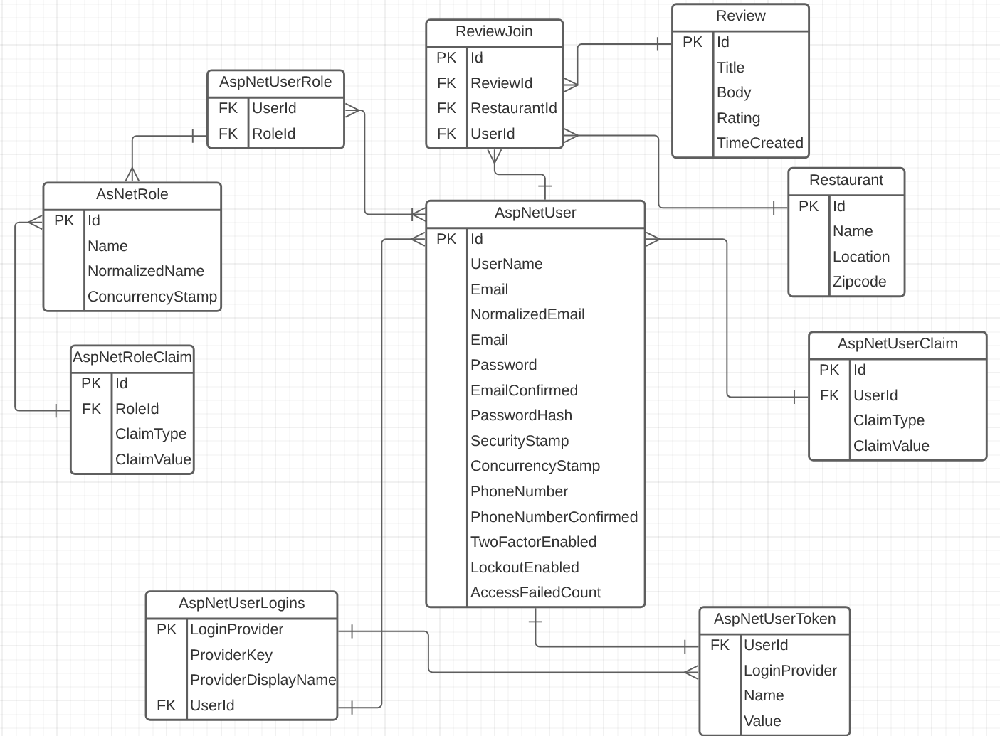

# P1 ASP.NET Core + Identity C# Restaurant Reviewer
## Description
This is an MVC Restaurant Review application that utilizing Microsoft Identity deployed through Azure Web Services. Users are able to view all restaurants, CRUD their reviews, and search restaurants by name. 

Deployed Website [here](http://restaurant-reviewer-kw.azurewebsites.net)
    
## Table of Contents 
* [Installation](#Installation) 
* [License](#License)
* [Tech Stack](#Tech-Stack)
* [Er Diagram](#Er-Diagram)
* [Contribution](#Contribution) 
* [Test](#Test) 
    
## Installation
You need at least .NET5 to run this application. You'll need to download and use dotnet restore to download the required packages. In addition, you'll need a User Secret's file in the UI folder that contains your AZURE database information. If you want to take advantage of Email confirmations, you'll also need to setup a GMAIL SMTP secret as well.
    

## License
    
This project falls under the mit license. Please visit [mit](https://choosealicense.com/licenses/mit) to learn more.

## Tech Stack

- C#
- ASP.NET MVC
- Xunit
- SQLServer DB
- EF Core 
- Serilog
- Microsoft ASP.NET Core Identity
- Azure Web Services
- Azure Dev Ops
- SonarCloud

## ER Diagram

- **ReviewJoin:** links Reviews/Restaurants/Users together
- **Reviews:** holds individual reviews
- **Restaurant:** holds restaurant information
- **AspNetRoleClaims:** holds claims assigned to a specific role.
- **AspNetRoles:** holds a list of roles. It is a lookup table of all possible roles that exist and can be assigned to a user.
- **AspNetUserClaims:** holds claims assigned to a user. A claim is different from a role because a claim is a key-value pair. You can have a role or not have a role. Claim also provides a value for a specified claim.
- **AspNetUserLogins:** connects external users to local users. All users specified in *AspNetUsers* table are local users. Say you want to login with Google and you want to link your Google account with your local account. This table holds that link so once you are linked you don’t have to go through the linking process again.
- **AspNetUserRoles:** it's a many-to-many relationship table that connects users with assigned roles.
- **AspNetUsers:** holds users. All of the user properties like username, email, password are stored here. We can also add custom user properties here to extend the user.
- **AspNetUserTokens:** holds external authentication tokens. This table is also used for keeping TOTP authenticator keys and recovery codes for user.

## Contribution
I'd like to thank Du T. and Jorge Y.!

## Test
This application uses Unix Testing. Simply navigate to the Tests folder and use 'dotnet test'.
    
## Questions
The author of this project is Keegan Wedwick. You can reach them via [email](mailto:kwedwick@gmail.com).
To see more projects from this author, visit their [GitHub](https://github.com/kwedwick).